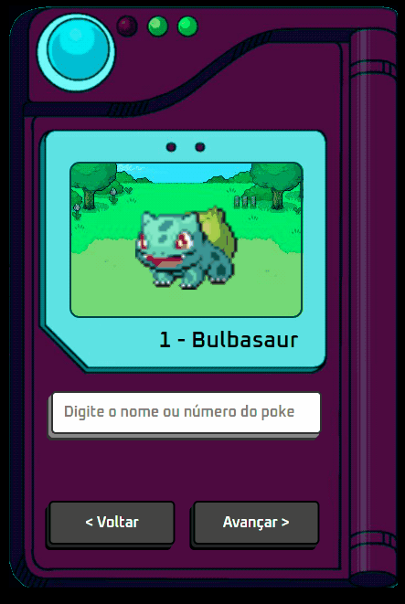

# Pokédex

  
  <h1>Pokédex</h1>

> ## Descrição
   A Pokédex é uma aplicação simples que permite aos usuários buscar informações sobre diferentes Pokémon. Você pode pesquisar pelo nome ou número do Pokémon desejado, visualizar detalhes como o número de Pokédex, nome e uma imagem animada do Pokémon.

> ## Tecnologias

  - HTML
  - CSS (arquivo `index.css`)
  - JavaScript (arquivo `index.js`)
  - [PokéAPI](https://pokeapi.co/) - API para obter dados dos Pokémon.

> ## Como usar

1. Faça o clone deste repositório: https://github.com/tiagofmuniz/pokedexGB.git
2. Abra o arquivo `index.html` em seu navegador.
3. Digite o nome ou número do Pokémon na caixa de pesquisa e pressione Enter.
4. Os detalhes do Pokémon, incluindo número na Pokédex, nome e uma imagem animada, serão exibidos.
5. Use os botões "Voltar" e "Avançar" para navegar entre os Pokémon.

> ## Principais aprendizados

- Integração com uma API externa (PokéAPI) para obter dados dinâmicos.
- Manipulação do DOM para exibir informações dos Pokémon.
- Utilização de eventos para interação do usuário.

**Observação:** Certifique-se de ter uma conexão com a internet para buscar informações dos Pokémon da PokéAPI.
